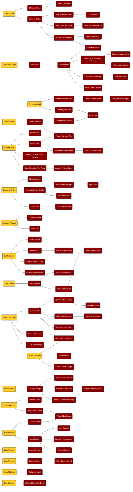

```mermaid
flowchart LR

%% Colors %%

classDef blue fill:#8B0000,stroke:#000,color:#FFF
classDef green fill:#FFCC33,stroke:#000,color:#000

%% O %%

%% Caleb Alpire's Line %%
M208(Caleb Alpire):::green---M254 & M235
M254(Christian Perez):::blue
M235(Jackson Bartay):::blue---M257 & M263 & M260 & M294
M257(Samuel Behrens):::blue
M294(Troy Alexander Davis):::blue---M315
M260(Joseph Michael Duran):::blue---M289
M263(Elena Ariana Hereford):::blue---M302
M263---M280(Avantika Chellury):::blue
M289(Connor Michael Malone):::blue
M302(Jenny Glendinning):::blue
M315(Chris Mendez):::blue

%% Jamaal Roberson's Line %%
M210(Jamaal Roberson):::green---M237
M237(Joel Philip):::blue---M251
M251(Gian Lezotte):::blue---M266 & M267 & M298
M266(Melchizedec Emanuel Correa):::blue---M287 & M301
M267(Michael Edward Potts):::blue---M292
M251---M280(Avantika Chellury):::blue
M287(Mikayla Leeann Wiest):::blue
M292(Shaunak Dabir):::blue
M298(Ryan Daniel Crowell):::blue
M301(Olivia Christen Huhn):::blue

%% Sarah McQuaid's Line %%
M209(Sarah McQuaid):::green---M258 & M288
M258(Nicholas Isaiah Garcia):::blue---M285
M285(Priscila Santos Romo):::blue
M288(Emma Lynn Rader):::blue
M288---M305(Deva Issa):::blue
M285---M306(Camryn Nicole Wagner):::blue

%% Remi Emmott's Line %%
M229(Remi Emmott):::green---M247
M247(Sarah Neidhardt):::blue---M261
M261(Kayla Michelle Waswil):::blue
M247---M282(Angela Kathleen Eller):::blue
M261---M305(Deva Issa):::blue

%% Anthony Mele's Line %%
M212(Anthony Mele):::green---M245 & M256 & M274 & M293
M256(Robert Turk):::blue---M272
M245(Quinlan Vos):::blue
M272(Joshua Austin Hernandez):::blue---M286
M274(Benny Eduardo Torres Zazueta):::blue
M256---M282(Angela Kathleen Eller):::blue
M293(Juan Sebastian Rios Pena):::blue---M311
M286(Duncan Collins Brown):::blue
M311(Jackson Andrew Taylor):::blue

%% Benjamin Griffin's Line %%
M211(Benjamin Griffin):::green---M250 & M259 & M262
M250(Flavian Ivasiuc):::blue
M259(Patrick Salvatore DiLullo):::blue---M279 & M295
M262(Julian Tan):::blue---M278
M278(Dario Nema Emad):::blue
M279(Blake Harrison Hajdik):::blue---M312
M295(Rosendo Torres):::blue
M312(Dylan Bell):::blue

%% Sharleen Faruque's Line %%
M215(Sharleen Faruque):::green---M231 & M242
M231(Clayton Stewart):::blue
M242(Noah Lee):::blue

%% Cecile Savoie's Line %%
M220(Cecile Savoie):::green---M236 & M249 & M268 & M300
M236(Neida Suarez):::blue
M249(Emma Button):::blue---M283
M268(Isabella Theresa Lopez):::blue
M283(Megan Helene Barry):::blue
M300(Cristina Maria Austgen):::blue

%% David Turlip's Line %%
M225(David Turlip):::green---M248
M248(Reid Neason):::blue---M276 & M297
M276(Tanner Weslee Waters):::blue
M297(Andrew Khanh Do):::blue

%% Gavin Thompson's Line %%
M228(Gavin Thompson):::green---M253 & M277
M253(Gavin Nicely):::blue---M264 & M281 & M307
M307(Tristan Kenneth Koster):::blue
M264(John Christopher Oake):::blue---M290 & M304
M290(Adam Dominic Vick):::blue
M304(Brandon Leung):::blue
M281(Christian Daniel Falk):::blue---M299
M299(Avery Jaxon Austin):::blue
M228---M296(Abhi Bhattacharyya):::blue
M277(Aiden Harris Long):::blue
M277---M303(Qynton De Los Santos):::blue

%% Austin Peterson's Line %%
M207(Austin Peterson):::green---M233 & M234
M233(Sumedh Khair):::blue
M234(Sodiq Adeniyi-Adeoye):::blue
M207---M303(Qynton De Los Santos):::blue

%% Hilaire Garza's Line %%
M232(Hilaire Garza):::green---M255
M255(Sydney Montoya):::blue---M273 & M275 & M313
M273(Jacob Armin Stevens):::blue
M275(Hannah Jeanne Lilly):::blue---M308
M308(Benjamin Timothy Allread):::blue
M313(Weston Coleman Browning):::blue

%% Kelsie Alexander's Line %%
M213(Kelsie Alexander):::green---M252 & M269
M252(Autumn Cook):::blue
M269(Katy Nicole Collier):::blue
M269---M309(Aidan D'Zur Rader):::blue

%% Mary Visconti's Line %%
M219(Mary Visconti):::green---M230 & M238
M230(Alexa Milstein):::blue---M270 & M271 & M291
M270(Avik S Ahuja):::blue
M238(Christian Kirk):::blue
M271(Laura Anne Stutzmann):::blue
M291(Aayushi Saxena):::blue
M238---M309(Aidan D'Zur Rader):::blue

%% Juan Arellano's Line %%
M226(Juan Arellano):::green---M246
M246(Avery Womble):::blue

%% Jake Marines' Line %%
M224(Jake Marines):::green---M265
M265(Zeeshan Virani):::blue---M284
M284(Aiden Jacob Mitchell):::blue

%% Oscar Martinez's Line %%
M227(Oscar Martinez):::green---M314
M314(Emily Carrizales):::blue

%% Jake Spooner's Line %%
M243(Jake Spooner):::green---M310
M310(William Christopher Davis):::blue
```
