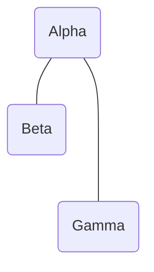
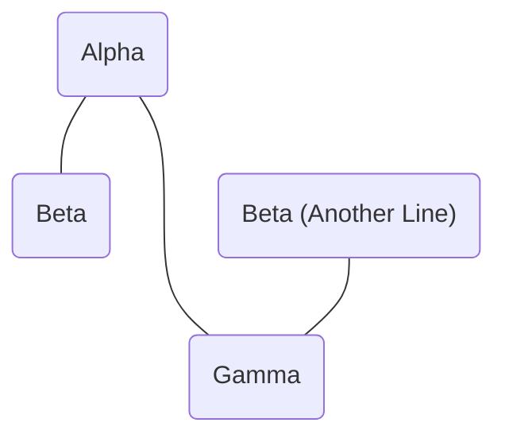
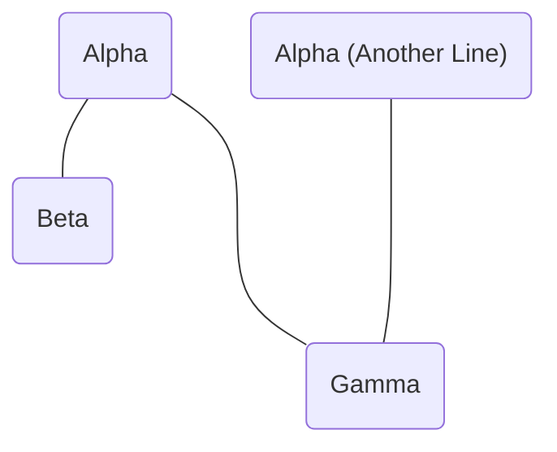
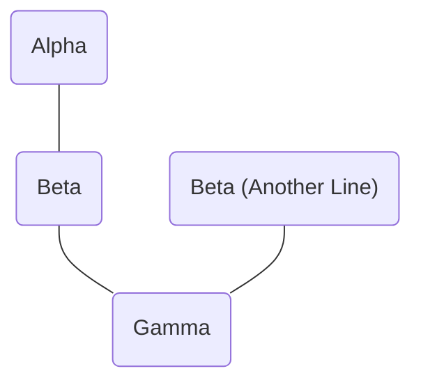

example: sarah (”alpha”) has littles nick (”delta”) and emma (”epsilon”), notice that sarah’s lines are longer because sarah did not pick up a little in the “beta” or “gamma” pledge classes. there are five dashes (’——-’) between her and nick and six (’———’) between her and emma

example: kayla (”delta”) and emma (“epsilon”) share deva (”zeta”)

example: sarah (”gamma”) and max (”gamma”) share angela (”epsilon”)

